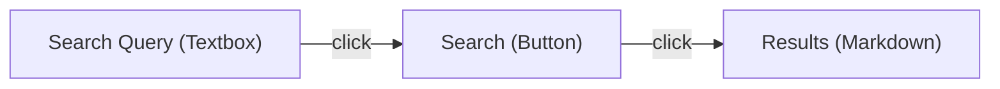

Integradio can export your component graph in multiple formats. This is useful for debugging dataflows, documenting your UI, and giving AI agents a map of the interface.

## Mermaid diagrams

Generate a [Mermaid](https://mermaid.js.org/) flowchart from your component graph:

```python
from integradio.viz import generate_mermaid

diagram = generate_mermaid(demo)
print(diagram)
```

Output:



Paste the output into any Mermaid-compatible renderer (GitHub markdown, Notion, Obsidian, etc.).

### Customizing Mermaid output

```python
diagram = generate_mermaid(
    demo,
    direction="TD",        # Top-down layout (default: "LR")
    show_intents=True,     # Include intent text in node labels
    show_tags=True,        # Show tags as node annotations
)
```

## D3.js interactive graphs

Generate a self-contained HTML page with an interactive force-directed graph:

```python
from integradio.viz import generate_html_graph

html = generate_html_graph(demo)

with open("graph.html", "w") as f:
    f.write(html)
```

The HTML page includes:

- **Drag-and-drop nodes** — rearrange the layout interactively
- **Hover tooltips** — show component intent, tags, and metadata
- **Zoom and pan** — navigate large graphs
- **Color coding** — nodes colored by component type (input, output, bidirectional)
- **Edge labels** — event types (click, change, submit, etc.)

### Customizing the D3 graph

```python
html = generate_html_graph(
    demo,
    width=1200,
    height=800,
    node_radius=20,
    link_distance=150,
    charge_strength=-300,
    dark_mode=True,         # Dark background (default: True)
)
```

## ASCII art

For terminal-friendly output, generate an ASCII representation:

```python
from integradio.viz import generate_ascii_graph

print(generate_ascii_graph(demo))
```

Output:

```
[Search Query] --click--> [Search] --click--> [Results]
     Textbox                Button              Markdown
  "user enters            "triggers            "displays
   search terms"           search"              results"
```

## Component tracing

Trace the upstream and downstream connections of a specific component:

```python
# Get the full dependency chain for a component
trace = demo.trace(results_component)

print(f"Upstream: {[c.label for c in trace.upstream]}")
print(f"Downstream: {[c.label for c in trace.downstream]}")
print(f"Events: {trace.events}")
```

### Visual trace

Combine tracing with Mermaid to highlight a specific path:

```python
from integradio.viz import generate_mermaid

diagram = generate_mermaid(demo, highlight=results_component)
# Highlighted nodes are styled with a different color
```

## FastAPI integration

Expose your component graph and search as REST endpoints:

```python
from fastapi import FastAPI

app = FastAPI()
demo.add_api_routes(app)
```

This adds the following routes:

### `GET /semantic/search`

Search components by natural language query.

```bash
curl "http://localhost:8000/semantic/search?q=user+input&k=5"
```

```json
[
  {
    "id": "comp_001",
    "label": "Search Query",
    "type": "Textbox",
    "intent": "user enters search terms",
    "score": 0.932,
    "tags": ["input", "text"]
  }
]
```

### `GET /semantic/component/{id}`

Get full metadata for a specific component.

```bash
curl "http://localhost:8000/semantic/component/comp_001"
```

### `GET /semantic/graph`

Export the entire component graph as JSON (D3-compatible format).

```bash
curl "http://localhost:8000/semantic/graph"
```

```json
{
  "nodes": [
    { "id": "comp_001", "label": "Search Query", "type": "Textbox", "intent": "..." }
  ],
  "links": [
    { "source": "comp_001", "target": "comp_002", "event": "click" }
  ]
}
```

### `GET /semantic/trace/{id}`

Trace upstream and downstream connections for a component.

```bash
curl "http://localhost:8000/semantic/trace/comp_003"
```

### `GET /semantic/summary`

Get a plain-text summary of all registered components.

```bash
curl "http://localhost:8000/semantic/summary"
```

## Using visualization for debugging

A practical workflow for debugging complex Gradio apps:

1. **Build your app** with `SemanticBlocks` and `semantic()` wrappers
2. **Generate a Mermaid diagram** to verify the dataflow matches your expectations
3. **Trace specific components** to check that events are wired correctly
4. **Run the FastAPI routes** to let AI agents query the component graph programmatically
5. **Export the D3 graph** for documentation or team reviews
